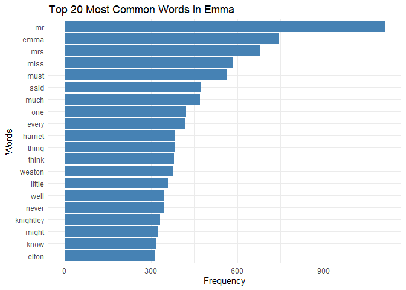

Assignment B-4
================

## Exercise 1

``` r
# libraries
library(janeaustenr)
```

    ## Warning: package 'janeaustenr' was built under R version 4.4.2

``` r
library(tidyverse)
```

    ## ── Attaching core tidyverse packages ──────────────────────── tidyverse 2.0.0 ──
    ## ✔ dplyr     1.1.4     ✔ readr     2.1.5
    ## ✔ forcats   1.0.0     ✔ stringr   1.5.1
    ## ✔ ggplot2   3.5.1     ✔ tibble    3.2.1
    ## ✔ lubridate 1.9.3     ✔ tidyr     1.3.1
    ## ✔ purrr     1.0.2     
    ## ── Conflicts ────────────────────────────────────────── tidyverse_conflicts() ──
    ## ✖ dplyr::filter() masks stats::filter()
    ## ✖ dplyr::lag()    masks stats::lag()
    ## ℹ Use the conflicted package (<http://conflicted.r-lib.org/>) to force all conflicts to become errors

``` r
library(stringr)
library(stopwords)
```

    ## Warning: package 'stopwords' was built under R version 4.4.2

``` r
library(dplyr)
library(purrr)


# emma text
emma_text <- janeaustenr::emma %>% 
  # combine lines in emma
  str_c(collapse = " ") %>%

  # remove punctuation
  str_replace_all("[[:punct:]]", "") %>%

  # convert to lower case
  str_to_lower()


# split into words
emma_words <- str_split(emma_text, "\\s+") %>% 
  unlist()


# english stop words in stopwords package (https://cran.r-project.org/web/packages/stopwords/readme/README.html)
stop_words <- stopwords("en")


# filter out stop words in emma. The discard method is in purrr package (https://purrr.tidyverse.org/articles/base.html)
filtered_words <- discard(emma_words, ~ .x %in% stop_words)


# count frequency of words in emma
word_counts <- as_tibble(filtered_words) %>%
  group_by(value) %>%
  summarise(n = n()) %>%
  arrange(desc(n))

# top 20 words
top_words <- word_counts %>%
  slice_max(order_by = n, n = 20)

# plot words frequency 
ggplot(top_words, aes(x = reorder(value, n), y = n)) +
  geom_col(fill = "steelblue") +
  coord_flip() +
  labs(title = "Top 20 Most Common Words in Emma",
    x = "Words",
    y = "Frequency") +
  theme_minimal()
```

<!-- -->

## Exercise 2

``` r
library(testthat)
```

    ## 
    ## Attaching package: 'testthat'

    ## The following object is masked from 'package:dplyr':
    ## 
    ##     matches

    ## The following object is masked from 'package:purrr':
    ## 
    ##     is_null

    ## The following objects are masked from 'package:readr':
    ## 
    ##     edition_get, local_edition

    ## The following object is masked from 'package:tidyr':
    ## 
    ##     matches

``` r
#' Convert Words to My Pig Latin
#' 
#' @description
#' The function converts English words to my version of Pig Latin.
#'
#' * Rearrangement:
#'  1.For words that begin with consonant sounds, all letters after the initial vowel are placed at the beginning of the word sequence.
#'  2.When words begin with consonant clusters (multiple consonants that form one sound), all letters after the initial vowel are placed at the beginning of the word sequence.
#'  3.For words beginning with vowel sounds, remove the first vowel sounds.
#' * Addition: Add "ez" to the beginning of the rearranged word.
#'
#' @param words A character vector of words to convert.
#' @return A character vector of words converted to my Pig Latin.
#' @examples
#' my_pig_latin("hello")    # "ezllohe"
#' my_pig_latin("friends")    # "ezendsfri"
#' my_pig_latin("eat")    # "ezat"
#' my_pig_latin(c("apple", "go")) # "ezpple", "ezgo"
#' @export
my_pig_latin <- function(words) {

  # Function to convert a single word
  convert_word <- function(word) {

    if (!is.character(word)) {
      stop("Input contains non-character")
    }

    # empty word
    if (word == "") {
        return("")
    }

    # Find the position of the first vowel
    first_vowel_position <- str_locate(word, "[aeiouAEIOU]")[1, 1]
    
    if (is.na(first_vowel_position)) {
      # no vowels in word
      rearrange <- word
     
    } else if (first_vowel_position == 1) {
    
      # remove vowel when word starts with a vowel
      rearrange <- str_sub(word, first_vowel_position + 1)
    } 
    
    else {

      # Move all letters after the first vowel to the beginning when word starts with consonants
      rearrange <- str_c(str_sub(word, first_vowel_position + 1), str_sub(word, 1, first_vowel_position))
    }
    
    # Add "ez" to the beginning
    additon <- str_c("ez", rearrange)
    
    
    return(additon)
  }
  
  # map conversion to every word in the vector
  res <- map_chr(words, convert_word)
  
  return(res)
}
```

### Examples

``` r
my_pig_latin("")
```

    ## [1] ""

``` r
my_pig_latin("hello")
```

    ## [1] "ezllohe"

``` r
my_pig_latin("friends")
```

    ## [1] "ezendsfri"

``` r
my_pig_latin("eat")
```

    ## [1] "ezat"

``` r
my_pig_latin(c("apple", "go"))
```

    ## [1] "ezpple" "ezgo"

### Testing

``` r
test_that("Check input", {

  # invalid input
  expect_error(my_pig_latin(123), "Input contains non-character")

  # empty string
  expect_equal(my_pig_latin(""), "")
})
```

    ## Test passed 🎉

``` r
test_that("Check single word", {
  # start with single consonant
  expect_equal(my_pig_latin("hello"), "ezllohe")
  
  # start with consonant cluster
  expect_equal( my_pig_latin("friends"), "ezendsfri")

  # start with vowel
  expect_equal(my_pig_latin("apple"), "ezpple")
})
```

    ## Test passed 🌈

``` r
test_that("Check multiple words in a vector", {
  expect_equal(my_pig_latin(c("go", "alpha")), c("ezgo", "ezlpha"))
  expect_equal(my_pig_latin(c("a", "bed")), c("ez", "ezdbe"))
  expect_equal(my_pig_latin(c("", "cat")), c("", "eztca"))
})
```

    ## Test passed 🌈
